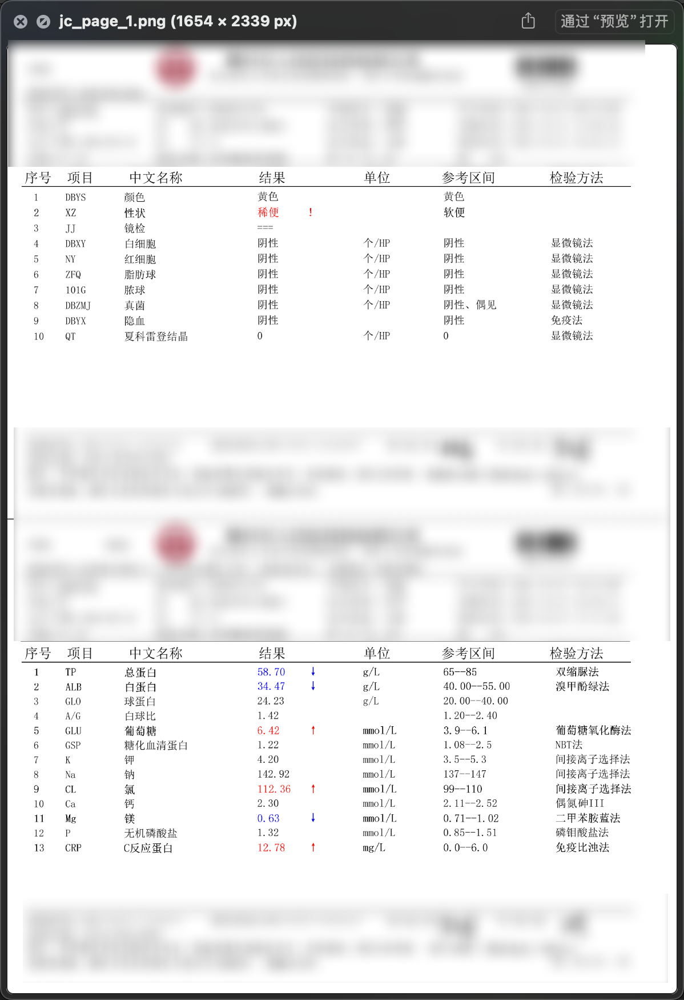
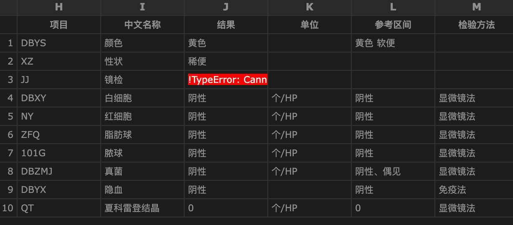
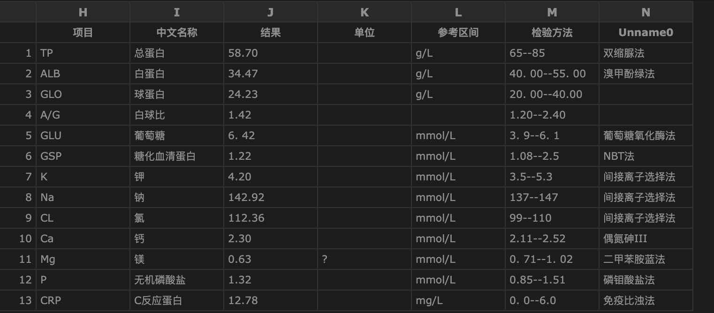

# 医学检查报告OCR关键信息提取工具

本项目基于[PaddleOCR](https://github.com/PaddlePaddle/PaddleOCR)，用于从医学检查报告中提取关键信息并将结果结构化输出。本工具支持对图像中的文字进行识别、表格解析和关键信息提取，适用于智能医疗文档处理场景。

---

## 功能特性

- **OCR文字识别**：基于PaddleOCR，支持多种医学检查报告的OCR识别。
- **表格结构化解析**：使用`img2table`库对报告中的表格信息进行提取和处理。
- **结果可视化**：支持识别结果的可视化，包括文字位置标注和表格绘制。
- **批量处理**：可对多个报告图像文件进行批量识别和结果保存。
- **灵活配置**：支持自定义日志输出路径、数据存储路径和识别模型参数。

---

## 环境依赖

运行本项目需要以下环境和依赖：
- Python >= 3.10
- PaddlePaddle >= 2.6.0
- PaddleOCR >= 2.7.0
- 其他依赖库：`opencv-python`, `matplotlib`, `numpy`, `pandas`, `tqdm`, `img2table`

安装依赖：
```bash
pip install -r requirements.txt
```

---

## 使用说明

1. **克隆项目**
   ```bash
   git clone https://github.com/your_username/medical_report_ocr.git
   cd medical_report_ocr
   ```

2. **准备数据**
   将医学检查报告的图像文件（支持`jpg`/`png`格式）存储在指定的输入目录中，例如`./data/images/`。

3. **运行脚本**
   执行以下命令开始OCR处理：
   ```bash
   python mutil_ocr.py --input_dir ./data/images/ --output_dir ./data/tabel_results
   ```
   完成对jpg进行表格识别后，需要再对每一个人的多个表格进行后处理以及统一：
   ```bash
   python merge_xlsx2csv.py --input_dir ./data/tabel_results --output_dir ./data/merge_tabel_results
   ```


4. **查看结果**
   - 提取的文本和表格数据将以`XX`和`CSV`格式保存在`./data`目录下。

---

## 代码实现思路

`ocr_table.py`主要包括以下实现步骤：

### 1. 初始化模块和配置
- 加载所需的库，包括`PaddleOCR`和`img2table`，用于OCR识别和表格解析。
- 初始化日志管理类，用于记录程序的运行状态和错误信息。

### 2. 图像读取与预处理
- 通过`cv2`读取输入目录中的医学检查报告图像。
- 对图像进行必要的预处理，例如去噪、灰度化或裁剪，以提高识别精度。

### 3. OCR识别
- 使用PaddleOCR的`PPStructure`模块进行文字识别。
- 结合`img2table`对检测到的表格区域进行进一步解析，将其转换为结构化数据。

### 4. 结果处理与保存
- 将OCR识别的文字、位置、置信度等信息保存为JSON格式。
- 通过`Pandas`将解析后的表格数据保存为CSV文件。

### 5. 批量处理与进度展示
- 通过`tqdm`模块对批量图像处理进行进度展示。
- 针对每张图像执行OCR和表格解析任务，保存每个任务的单独结果。

---

## 参数配置

脚本支持以下参数：
- `--input_dir`：输入图像文件所在目录。
- `--output_dir`：输出结果保存路径。
- `--log_path`：日志文件路径，默认为`./logs/ocr.log`。

示例：
```bash
python ocr_table.py --input_dir ./test_data/ --output_dir ./output/ --log_path ./logs/run.log 
```

---

## 示例效果

原始医学报告图像：  


OCR识别结果：  



---

## 常见问题

### 1. PaddleOCR模型下载失败？
请参考[PaddleOCR官方文档](https://github.com/PaddlePaddle/PaddleOCR)检查模型路径和网络连接。

### 2. 表格解析不准确？
尝试调整`img2table`的解析参数，或对输入图像进行预处理（如去噪、裁剪）。

---

## 贡献

欢迎提交Issue和Pull Request来改进本项目。如有任何问题，请联系项目维护者。

---

## 许可证

本项目基于[Apache License 2.0](./LICENSE)开源。
